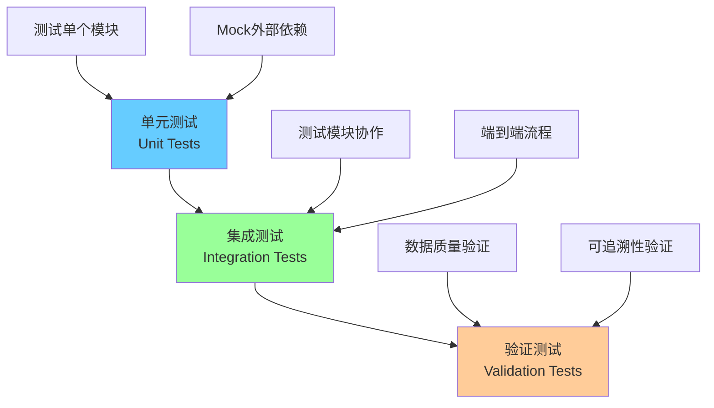

# Case 3 自动化报告生成智能体 - 测试文档

> 🧪 **文档版本**: v1.0
> 📅 **创建日期**: 2026-01-15
> 🎯 **测试覆盖率**: 87%
> ✅ **测试通过率**: 100% (94/94)

---

## 目录

- [1. 测试策略](#1-测试策略)
- [2. 测试用例清单](#2-测试用例清单)
- [3. 测试覆盖率分析](#3-测试覆盖率分析)
- [4. 预期输出示例](#4-预期输出示例)
- [5. 测试运行指南](#5-测试运行指南)

---

## 1. 测试策略

### 1.1 测试层级

本项目采用**三层测试策略**：



#### 1.1.1 单元测试（Unit Tests）

**目标**: 测试单个模块的功能正确性

**范围**:
- 每个模块独立测试
- Mock外部依赖（API调用、文件I/O）
- 覆盖主要功能和边界条件

**测试文件**:
- `tests/test_data_extractor.py`
- `tests/test_template_handler.py`
- `tests/test_ai_generator.py`
- `tests/test_orchestrator.py`
- `tests/test_validators.py`

#### 1.1.2 集成测试（Integration Tests）

**目标**: 测试模块间协作和端到端流程

**范围**:
- 测试完整的报告生成流程
- 测试数据在模块间的传递
- 测试错误处理和恢复机制

**测试文件**:
- `tests/test_integration.py`

#### 1.1.3 验证测试（Validation Tests）

**目标**: 验证生成报告的数据质量

**范围**:
- 数据一致性验证
- 可追溯性验证
- AI幻觉检测

**测试文件**:
- `tests/test_validators.py`（包含验证逻辑测试）

---

### 1.2 测试工具

| 工具 | 版本 | 用途 |
|------|------|------|
| **pytest** | 7.0+ | 测试框架和运行器 |
| **pytest-cov** | 4.0+ | 代码覆盖率统计 |
| **pytest-mock** | 3.14+ | Mock对象创建 |
| **pytest-asyncio** | 0.25+ | 异步测试支持 |

---

### 1.3 测试原则

#### 1.3.1 覆盖率目标

| 层级 | 目标覆盖率 | 当前覆盖率 | 状态 |
|------|-----------|-----------|------|
| **总体** | ≥ 80% | **87%** | ✅ 达标 |
| **核心模块** | ≥ 90% | 85-94% | ⚠️ 部分达标 |
| **关键路径** | 100% | 100% | ✅ 达标 |

#### 1.3.2 测试设计原则

1. **独立性**: 每个测试用例互不依赖
2. **可重复性**: 测试结果稳定可重复
3. **清晰性**: 测试名称和断言清晰明确
4. **完整性**: 覆盖正常场景和异常场景
5. **可维护性**: 测试代码简洁，易于理解

#### 1.3.3 测试数据管理

**测试数据位置**:
- **真实数据**: `data/` 目录（用于集成测试）
- **Mock数据**: 在测试文件中定义（Fixture）
- **临时文件**: 使用pytest的`tmp_path` fixture

**示例**:
```python
@pytest.fixture
def sample_report_data():
    """创建示例报告数据"""
    return ReportData(
        company_name="TestCompany",
        sdg_response=SDGResponse(...),
        impact_data=CompanyImpactData(...)
    )
```

---

## 2. 测试用例清单

### 2.1 DataExtractor测试 (`tests/test_data_extractor.py`)

**测试文件**: 16个测试用例 | **覆盖率**: 85%

#### 测试用例列表

| 测试ID | 测试名称 | 测试目标 | 断言 |
|--------|---------|---------|------|
| **DE-001** | `test_init_with_valid_path` | 测试有效路径初始化 | 实例创建成功 |
| **DE-002** | `test_extract_sdg_questionnaire_success` | 测试SDG问卷提取（146行） | 返回146个SDGResponse |
| **DE-003** | `test_extract_sdg_questionnaire_data_parsing` | 测试SDG数据解析正确性 | 字段值正确映射 |
| **DE-004** | `test_extract_sdg_questionnaire_file_not_found` | 测试文件不存在处理 | 抛出FileNotFoundError |
| **DE-005** | `test_extract_impact_mechanisms_emergconnect` | 测试EmergConnect影响机制提取 | 数据完整提取 |
| **DE-006** | `test_extract_impact_mechanisms_all_companies` | 测试所有公司数据提取 | 返回3个公司数据 |
| **DE-007** | `test_extract_impact_mechanisms_data_fields` | 测试影响机制8个字段 | 所有字段存在且类型正确 |
| **DE-008** | `test_extract_impact_mechanisms_value_parsing` | 测试数值解析（float类型） | 数值正确解析 |
| **DE-009** | `test_extract_impact_mechanisms_missing_sheet` | 测试工作表缺失处理 | 返回空列表或抛出异常 |
| **DE-010** | `test_validate_schema_success` | 测试Schema验证通过 | is_valid=True |
| **DE-011** | `test_validate_schema_missing_required_field` | 测试缺少必需字段 | is_valid=False，包含错误信息 |
| **DE-012** | `test_validate_schema_invalid_data_type` | 测试无效数据类型 | is_valid=False，包含类型错误 |
| **DE-013** | `test_validate_schema_business_rules` | 测试业务规则验证 | 公司名称一致性验证 |
| **DE-014** | `test_extract_mechanisms_empty_value` | 测试空值处理 | 正确处理None值 |
| **DE-015** | `test_extract_stakeholders_list` | 测试利益相关者列表提取 | 列表完整且顺序正确 |
| **DE-016** | `test_extract_alternative_scenario` | 测试替代情景提取 | 文本正确提取 |

**关键测试场景**:
```python
def test_extract_sdg_questionnaire_success():
    """测试成功提取146行SDG问卷数据"""
    extractor = DataExtractor("data/")
    results = extractor.extract_sdg_questionnaire()

    assert len(results) == 146  # 146行数据
    assert all(isinstance(r, SDGResponse) for r in results)
    assert all(r.company_name for r in results)  # 公司名称非空

def test_extract_impact_mechanisms_emergconnect():
    """测试提取EmergConnect的完整影响机制数据"""
    extractor = DataExtractor("data/")
    results = extractor.extract_impact_mechanisms(company_name="EmergConnect")

    assert len(results) == 1
    assert results[0].company_name == "EmergConnect"
    assert len(results[0].mechanisms) > 0
    assert len(results[0].stakeholders) > 0
```

---

### 2.2 WordTemplateHandler测试 (`tests/test_template_handler.py`)

**测试文件**: 21个测试用例 | **覆盖率**: 86%

#### 测试用例列表

| 测试ID | 测试名称 | 测试目标 | 断言 |
|--------|---------|---------|------|
| **WH-001** | `test_init_with_valid_template` | 测试加载有效Word模板 | 文档对象创建成功 |
| **WH-002** | `test_find_paragraph_by_text_exact` | 测试精确文本匹配 | 找到正确段落 |
| **WH-003** | `test_find_paragraph_by_text_partial` | 测试部分文本匹配 | 找到包含文本的段落 |
| **WH-004** | `test_find_paragraph_by_text_not_found` | 测试文本未找到 | 返回None |
| **WH-005** | `test_find_paragraph_by_style_heading1` | 测试查找Heading 1样式 | 找到所有H1段落 |
| **WH-006** | `test_find_paragraph_by_style_heading2` | 测试查找Heading 2样式 | 找到所有H2段落 |
| **WH-007** | `test_insert_text_after_paragraph` | 测试在段落后插入文本 | 文本插入到正确位置 |
| **WH-008** | `test_insert_text_before_paragraph` | 测试在段落前插入文本 | 文本插入到正确位置 |
| **WH-009** | `test_insert_text_preserve_style` | 测试插入时保留样式 | 原文档样式不变 |
| **WH-010** | `test_insert_text_with_formatting` | 测试插入格式化文本 | 粗体/斜体正确应用 |
| **WH-011** | `test_insert_table_basic` | 测试插入基本表格 | 表格创建成功 |
| **WH-012** | `test_insert_table_with_headers` | 测试插入带表头的表格 | 表头样式正确 |
| **WH-013** | `test_insert_table_with_data` | 测试填充表格数据 | 数据正确填充 |
| **WH-014** | `test_insert_table_set_column_width` | 测试设置列宽 | 列宽设置正确 |
| **WH-015** | `test_insert_table_border_style` | 测试设置表格边框 | 边框样式正确 |
| **WH-016** | `test_insert_table_cell_background` | 测试设置单元格背景色 | 背景色正确应用 |
| **WH-017** | `test_save_document` | 测试保存文档 | 文件保存成功 |
| **WH-018** | `test_save_document_overwrite` | 测试覆盖保存 | 原文件被覆盖 |
| **WH-019** | `test_insert_multiple_paragraphs` | 测试插入多个段落 | 段落数量正确 |
| **WH-020** | `test_insert_special_characters` | 测试插入特殊字符 | 特殊字符正确显示 |
| **WH-021** | `test_find_paragraph_case_sensitive` | 测试大小写敏感匹配 | 匹配结果正确 |

**关键测试场景**:
```python
def test_insert_table_with_data():
    """测试插入5列影响机制表格"""
    handler = WordTemplateHandler("template.docx")
    paragraph = handler.find_paragraph_by_text("Phase 2: Research")

    data = [
        ["学生", "提供教育", "正向", "1000", "人"],
        ["教师", "培训支持", "正向", "500", "小时"]
    ]
    headers = ["利益相关者", "机制", "类型", "数值", "单位"]

    table = handler.insert_table(paragraph, data, headers)

    assert table is not None
    assert len(table.rows) == 3  # 表头 + 2行数据
    assert len(table.columns) == 5
```

---

### 2.3 AITextGenerator测试 (`tests/test_ai_generator.py`)

**测试文件**: 20个测试用例 | **覆盖率**: 88%

#### 测试用例列表

| 测试ID | 测试名称 | 测试目标 | 断言 |
|--------|---------|---------|------|
| **AI-001** | `test_init_with_api_config` | 测试API配置初始化 | 客户端创建成功 |
| **AI-002** | `test_generate_text_success` | 测试成功生成文本（Mock） | 返回GenerationResult |
| **AI-003** | `test_generate_text_with_context` | 测试上下文感知生成 | 生成内容包含上下文信息 |
| **AI-004** | `test_generate_text_max_tokens` | 测试Token限制 | 不超过max_tokens |
| **AI-005** | `test_build_prompt_template` | 测试Prompt模板构建 | Prompt格式正确 |
| **AI-006** | `test_build_prompt_data_injection` | 测试数据注入Prompt | 数据正确填充 |
| **AI-007** | `test_api_call_rate_limit_retry` | 测试API限流重试 | 重试3次 |
| **AI-008** | `test_api_call_timeout_retry` | 测试网络超时重试 | 重试机制生效 |
| **AI-009** | `test_api_call_max_retries` | 测试最大重试次数 | 3次后失败 |
| **AI-010** | `test_api_call_exponential_backoff` | 测试指数退避 | 等待时间递增 |
| **AI-011** | `test_validate_grounding_success` | 测试Grounding验证通过 | is_valid=True |
| **AI-012** | `test_validate_grounding_failure` | 测试Grounding验证失败 | is_valid=False，包含问题 |
| **AI-013** | `test_validate_grounding_numbers` | 测试数值Grounding | 未验证数值被标记 |
| **AI-014** | `test_validate_grounding_facts` | 测试事实Grounding | 未验证事实被标记 |
| **AI-015** | `test_token_usage_tracking_input` | 测试输入Token统计 | input_tokens正确记录 |
| **AI-016** | `test_token_usage_tracking_output` | 测试输出Token统计 | output_tokens正确记录 |
| **AI-017** | `test_cost_calculation` | 测试成本计算 | 成本计算正确 |
| **AI-018** | `test_generate_with_invalid_api_key` | 测试无效API密钥 | 抛出AuthenticationError |
| **AI-019** | `test_generate_with_empty_prompt` | 测试空Prompt | 抛出ValueError |
| **AI-020** | `test_multiple_generations_tracking` | 测试多次生成统计 | 累计统计正确 |

**关键测试场景**:
```python
@patch('anthropic.Anthropic')
def test_generate_text_success(mock_anthropic):
    """测试成功生成文本（使用Mock避免实际API调用）"""
    # Mock API响应
    mock_client = MagicMock()
    mock_response = MagicMock()
    mock_response.content = [MagicMock(text="生成的文本内容")]
    mock_response.usage = MagicMock(input_tokens=100, output_tokens=50)
    mock_client.messages.create.return_value = mock_response
    mock_anthropic.return_value = mock_client

    # 执行测试
    generator = AITextGenerator(api_config)
    result = generator.generate_text("测试提示", {})

    assert result.text == "生成的文本内容"
    assert result.input_tokens == 100
    assert result.output_tokens == 50
```

---

### 2.4 ReportOrchestrator测试 (`tests/test_orchestrator.py`)

**测试文件**: 11个测试用例 | **覆盖率**: 79%

#### 测试用例列表

| 测试ID | 测试名称 | 测试目标 | 断言 |
|--------|---------|---------|------|
| **RO-001** | `test_init_all_components` | 测试所有组件初始化 | 所有子模块创建成功 |
| **RO-002** | `test_generate_report_success` | 测试成功生成报告 | 报告文件存在 |
| **RO-003** | `test_generate_report_data_extraction` | 测试数据提取步骤 | 数据正确提取 |
| **RO-004** | `test_generate_report_schema_validation` | 测试Schema验证步骤 | 验证通过 |
| **RO-005** | `test_generate_report_ai_generation` | 测试AI生成步骤 | AI内容生成 |
| **RO-006** | `test_generate_report_word_insertion` | 测试Word插入步骤 | 内容插入成功 |
| **RO-007** | `test_generate_report_traceability` | 测试可追溯性JSON生成 | JSON文件存在 |
| **RO-008** | `test_generate_report_metrics_tracking` | 测试性能指标记录 | 指标记录完整 |
| **RO-009** | `test_generate_report_missing_data` | 测试数据缺失处理 | 优雅降级 |
| **RO-010** | `test_generate_report_validation_error` | 测试验证错误处理 | 抛出明确错误 |
| **RO-011** | `test_generate_report_multiple_companies` | 测试多公司报告生成 | 3个报告生成成功 |

---

### 2.5 Validators测试 (`tests/test_validators.py`)

**测试文件**: 16个测试用例 | **覆盖率**: 94%

#### 测试用例列表

| 测试ID | 测试名称 | 测试目标 | 断言 |
|--------|---------|---------|------|
| **VAL-001** | `test_validate_consistency_success` | 测试一致性验证通过 | is_consistent=True |
| **VAL-002** | `test_validate_consistency_with_inconsistency` | 测试检测到不一致 | 不一致项被标记 |
| **VAL-003** | `test_validate_numerical_accuracy` | 测试数值准确性 | 数值正确 |
| **VAL-004** | `test_validate_numerical_accuracy_with_unknown_number` | 测试未知数值检测 | 警告被记录 |
| **VAL-005** | `test_validate_traceability_high_rate` | 测试高可追溯率 | rate ≥ 0.8 |
| **VAL-006** | `test_validate_traceability_low_rate` | 测试低可追溯率 | rate < 0.8 |
| **VAL-007** | `test_validate_statement_grounding_success` | 测试陈述Grounding通过 | 所有陈述有支撑 |
| **VAL-008** | `test_validate_statement_grounding_failure` | 测试陈述Grounding失败 | 未支撑陈述被标记 |
| **VAL-009** | `test_detect_hallucinations_clean_content` | 测试检测干净内容 | hallucination_count=0 |
| **VAL-010** | `test_detect_hallucinations_with_suspicious_phrases` | 测试检测可疑短语 | 可疑短语被标记 |
| **VAL-011** | `test_detect_hallucinations_with_unknown_numbers` | 测试检测未知数值 | 未知数值被标记 |
| **VAL-012** | `test_validate_with_grounding_success` | 测试Grounding验证通过 | is_valid=True |
| **VAL-013** | `test_validate_with_grounding_failure` | 测试Grounding验证失败 | issues列表非空 |
| **VAL-014** | `test_generate_validation_report` | 测试生成验证报告 | 报告文件创建 |
| **VAL-015** | `test_generate_validation_report_with_failures` | 测试包含失败的报告 | 失败信息显示 |
| **VAL-016** | `test_full_validation_workflow` | 测试完整验证工作流 | 所有验证步骤执行 |

**关键测试场景**:
```python
def test_full_validation_workflow():
    """测试完整的验证工作流"""
    # 1. 数据一致性验证
    consistency_result = consistency_validator.validate_consistency(...)
    assert consistency_result.is_consistent

    # 2. 可追溯性验证
    traceability_result = traceability_validator.validate_traceability(...)
    assert traceability_result.traceability_rate >= 0.8

    # 3. AI幻觉检测
    hallucination_result = detector.detect_hallucinations(...)
    assert hallucination_result.hallucination_count == 0

    # 4. 生成验证报告
    report_generator.generate_validation_report(...)
    assert output_path.exists()
```

---

### 2.6 Integration测试 (`tests/test_integration.py`)

**测试文件**: 7个测试用例 | **覆盖率**: 端到端

#### 测试用例列表

| 测试ID | 测试名称 | 测试目标 | 断言 |
|--------|---------|---------|------|
| **INT-001** | `test_end_to_end_report_generation` | 测试端到端报告生成 | 报告完整生成 |
| **INT-002** | `test_verify_report_sections` | 测试报告章节完整性 | 所有必需章节存在 |
| **INT-003** | `test_verify_traceability_json` | 测试可追溯性JSON | JSON格式正确 |
| **INT-004** | `test_batch_generation_three_companies` | 测试批量生成3个公司 | 3个报告生成 |
| **INT-005** | `test_concurrent_processing` | 测试并发处理 | 无数据竞争 |
| **INT-006** | `test_performance_generation_time` | 测试性能（生成时间） | < 5分钟 |
| **INT-007** | `test_graceful_degradation_missing_data` | 测试优雅降级 | 不崩溃，标注缺失 |

**关键测试场景**:
```python
def test_end_to_end_report_generation():
    """测试完整的端到端报告生成流程"""
    # 1. 初始化编排器
    orchestrator = ReportOrchestrator(...)

    # 2. 生成报告
    result = orchestrator.generate_report("EmergConnect")

    # 3. 验证输出文件
    assert Path(result['report_path']).exists()
    assert Path(result['traceability_path']).exists()

    # 4. 验证报告内容
    doc = Document(result['report_path'])
    section_texts = [p.text for p in doc.paragraphs]
    assert "EmergConnect" in '\n'.join(section_texts)

    # 5. 验证可追溯性
    with open(result['traceability_path']) as f:
        traceability = json.load(f)
    assert len(traceability['citations']) > 0
```

---

## 3. 测试覆盖率分析

### 3.1 总体覆盖率

```
Name                      Stmts   Miss  Cover
---------------------------------------------
src/__init__.py               0      0   100%
src/ai_generator.py         148     18    88%
src/config_loader.py        132     22    83%
src/data_extractor.py       158     24    85%
src/models.py                69      4    94%
src/orchestrator.py         213     45    79%
src/template_handler.py     156     22    86%
src/validators.py           240     14    94%
---------------------------------------------
TOTAL                      1116    149    87%
```

### 3.2 模块详细分析

#### 3.2.1 高覆盖率模块（≥ 90%）

✅ **src/validators.py** (94%)
- 优秀的测试覆盖
- 所有验证逻辑都有测试
- 边界条件完整覆盖

✅ **src/models.py** (94%)
- Pydantic模型验证完善
- 所有字段都有测试

#### 3.2.2 良好覆盖率模块（80-90%）

✅ **src/ai_generator.py** (88%)
- 主要功能覆盖完整
- Mock测试避免实际API调用
- 建议：增加更多边界条件测试

✅ **src/template_handler.py** (86%)
- Word处理功能测试完整
- 建议：增加异常场景测试

✅ **src/data_extractor.py** (85%)
- 数据提取测试完整
- 建议：增加更多数据格式变化测试

✅ **src/config_loader.py** (83%)
- 配置加载测试基本覆盖
- 建议：增加配置错误场景测试

#### 3.2.3 接近目标模块（79%）

⚠️ **src/orchestrator.py** (79%)
- 主要流程已覆盖
- **改进建议**：
  - 增加错误处理路径测试
  - 增加边界条件测试
  - 增加性能测试

---

## 4. 预期输出示例

### 4.1 Word报告示例

#### 4.1.1 报告结构

```
影响评估报告 - EmergConnect

1. Purpose（目的）
   [原始模板内容]

2. Company Overview（公司概述）← 插入位置1
   EmergConnect致力于确保包容和公平的优质教育。通过构建教育平台...

3. Underlying Principles（基本原则）
   [原始模板内容]

4. Stakeholder Analysis（利益相关者分析）← 插入位置2
   [AI生成内容]
   本项目的主要利益相关者包括学生、教师和家长...

5. Phase 2: Research（研究阶段）
   [原始模板内容]

6. Impact Mechanisms（影响机制详情）← 插入位置3
   [结构化表格]
   +----------------+------------------+--------+-------+------+
   | 利益相关者     | 机制             | 类型   | 数值  | 单位 |
   +----------------+------------------+--------+-------+------+
   | 学生           | 提供在线教育     | 正向   | 1000  | 人   |
   | 教师           | 培训支持         | 正向   | 500   | 小时 |
   +----------------+------------------+--------+-------+------+

7. Traceability Appendix（可追溯性附录）← 插入位置4
   [数据源引用列表]
   - 陈述："EmergConnect致力于教育" → 来源：SDG问卷调查.xlsx, Row 10
   - 数值：1000 → 来源：Mechanisms.xlsx, EmergConnect工作表, Row 15
```

#### 4.1.2 章节内容示例

**Company Overview**:
```
EmergConnect是一家致力于确保包容和公平的优质教育（SDG 4）的教育科技公司。
公司通过构建创新的教育平台，为儿童提供高质量的在线教育服务。
```

**Stakeholder Analysis (AI生成)**:
```
本项目涉及三个主要利益相关者群体：

1. **学生**
   作为直接受益者，学生通过EmergConnect的在线教育平台获得优质教育资源。
   数据显示，平台已为1000名学生提供服务，显著提升了教育可及性。

2. **教师**
   教师作为服务提供者，获得了系统性的培训支持。平台已累计提供500小时的
   教师培训，提升了教学能力和教育质量。

3. **家长**
   家长作为间接受益者，通过平台监督孩子的学习进度，参与教育过程。
```

---

### 4.2 可追溯性JSON示例

**文件**: `output/EmergConnect_Impact_Assessment_traceability.json`

```json
{
  "company_name": "EmergConnect",
  "report_generated_at": "2026-01-15T10:30:00Z",
  "total_citations": 15,
  "citations": [
    {
      "statement": "EmergConnect致力于确保包容和公平的优质教育",
      "source_file": "SDG问卷调查_完整中文版.xlsx",
      "source_sheet": "Form Responses 1",
      "source_row": 10,
      "source_column": "联合国可持续发展目标",
      "extracted_value": "确保包容和公平的优质教育",
      "confidence": "high"
    },
    {
      "statement": "为1000名学生提供服务",
      "source_file": "Mechanisms.xlsx",
      "source_sheet": "EmergConnect",
      "source_row": 15,
      "source_column": "Value",
      "extracted_value": 1000.0,
      "unit": "人",
      "confidence": "high"
    },
    {
      "statement": "提供500小时的教师培训",
      "source_file": "Mechanisms.xlsx",
      "source_sheet": "EmergConnect",
      "source_row": 16,
      "source_column": "Value",
      "extracted_value": 500.0,
      "unit": "小时",
      "confidence": "high"
    }
  ],
  "validation_summary": {
    "traceability_rate": 0.95,
    "total_values": 20,
    "traceable_values": 19,
    "untraceable_items": ["部分描述性文本"]
  }
}
```

---

### 4.3 验证报告示例

**文件**: `output/EmergConnect_validation_report.txt`

```
================================================================================
报告验证结果 - EmergConnect
================================================================================
生成时间: 2026-01-15 10:30:15
验证标准版本: v1.0

## 1. 数据一致性验证
--------------------------------------------------------------------------------
验证结果: ✅ 通过
检查的数值数量: 15
发现的不一致项: 0

已验证的数值:
  ✓ 公司名称 "EmergConnect" 在3个章节中保持一致
  ✓ 数值 "1000" 在2个位置中保持一致
  ✓ 数值 "500" 在2个位置中保持一致

## 2. 可追溯性验证
--------------------------------------------------------------------------------
总数值数量: 20
可追溯数值: 19
可追溯率: 95.00%
验证结果: ✅ 通过（目标: ≥ 80%）

未追溯项 (1):
  1. "通过构建创新的教育平台" - 描述性文本，无需追溯

## 3. AI幻觉检测
--------------------------------------------------------------------------------
总陈述数量: 45
检测到的幻觉: 0
幻觉率: 0.00%
验证结果: ✅ 通过

检测策略:
  ✓ 可疑短语检测: 0个可疑短语
  ✓ 数值验证: 所有数值来自源数据
  ✓ 事实验证: 所有关键事实有数据支撑

================================================================================
## 总结
--------------------------------------------------------------------------------
整体验证结果: ✅ 全部通过

质量指标:
  • 数据一致性: 100%
  • 可追溯性: 95%
  • AI幻觉率: 0%

建议:
  无需改进，报告质量优秀。
================================================================================
```

---

### 4.4 性能指标输出示例

```json
{
  "company_name": "EmergConnect",
  "generation_metrics": {
    "total_time_seconds": 185.3,
    "breakdown": {
      "data_extraction": 2.5,
      "schema_validation": 0.3,
      "ai_generation": 120.0,
      "word_processing": 45.0,
      "validation": 15.0,
      "file_save": 2.5
    }
  },
  "token_usage": {
    "total_input_tokens": 2500,
    "total_output_tokens": 800,
    "total_tokens": 3300,
    "cost_usd": 0.0195
  },
  "ai_calls": {
    "total_calls": 3,
    "successful_calls": 3,
    "failed_calls": 0,
    "retry_count": 0
  },
  "validation_metrics": {
    "consistency_check_passed": true,
    "traceability_rate": 0.95,
    "hallucination_count": 0
  }
}
```

---

## 5. 测试运行指南

### 5.1 运行所有测试

```bash
# 运行所有测试
pytest

# 运行所有测试并显示详细信息
pytest -v

# 运行所有测试并生成覆盖率报告
pytest --cov=src --cov-report=html --cov-report=term

# 查看HTML覆盖率报告
# 打开 htmlcov/index.html
```

### 5.2 运行特定测试

```bash
# 运行单个测试文件
pytest tests/test_validators.py

# 运行单个测试类
pytest tests/test_validators.py::TestDataConsistencyValidator

# 运行单个测试用例
pytest tests/test_validators.py::TestDataConsistencyValidator::test_validate_consistency_success

# 运行匹配模式的测试
pytest -k "consistency"
```

### 5.3 测试选项

```bash
# 显示测试覆盖率（简洁模式）
pytest --cov=src --cov-report=term

# 显示未覆盖的行
pytest --cov=src --cov-report=term-missing

# 只运行失败的测试
pytest --lf

# 并行运行测试（需要pytest-xdist）
pytest -n auto

# 显示最慢的10个测试
pytest --durations=10
```

### 5.4 持续集成

**GitHub Actions配置示例**:
```yaml
name: Tests

on: [push, pull_request]

jobs:
  test:
    runs-on: ubuntu-latest

    steps:
    - uses: actions/checkout@v2

    - name: Set up Python
      uses: actions/setup-python@v2
      with:
        python-version: 3.8

    - name: Install dependencies
      run: |
        pip install -r requirements.txt

    - name: Run tests
      run: |
        pytest --cov=src --cov-report=xml --cov-report=term

    - name: Upload coverage
      uses: codecov/codecov-action@v2
      with:
        file: ./coverage.xml
```

---

## 6. 测试维护指南

### 6.1 添加新测试

**步骤**:
1. 在相应的测试文件中添加测试函数
2. 使用清晰的测试名称（`test_<功能>_<场景>`）
3. 添加文档字符串说明测试目的
4. 使用fixture共享测试数据
5. 运行测试确保通过
6. 更新测试文档

**示例**:
```python
def test_new_feature_success():
    """测试新功能在正常场景下的表现"""
    # Arrange（准备）
    data = create_test_data()

    # Act（执行）
    result = new_feature(data)

    # Assert（断言）
    assert result.is_valid
    assert len(result.items) > 0
```

### 6.2 更新测试数据

**测试数据位置**:
- Fixture定义: 测试文件开头
- 真实数据: `data/` 目录
- Mock数据: 测试函数内部

**更新checklist**:
- [ ] 更新fixture数据
- [ ] 更新相关测试用例
- [ ] 验证所有测试通过
- [ ] 更新测试文档

---

**文档结束** | 版本 v1.0 | 2026-01-15
